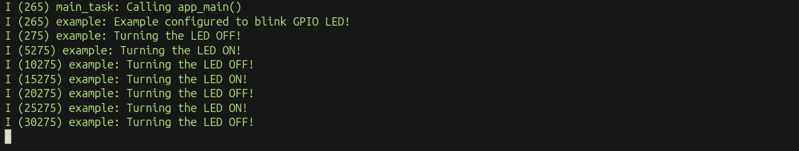

# ESP32 LED Blinking

A basic **ESP32 LED blinking project** using **ESP-IDF and FreeRTOS**, created as a starting point for getting familiar with ESP32 development, the ESP-IDF environment, and **RTOS concepts**.

## Hardware Requirements

* ESP32 MCU / Development Board
* USB cable

## Software Requirements

* ESP-IDF installed and configured
* VS Code

> FreeRTOS is integrated into ESP-IDF.

## GPIO Configuration

The LED is configured on **GPIO 2** in this project.

```c
#define LED_GPIO 2
```

> **Note:** GPIO numbers can differ depending on the ESP32 MCU/development board and hardware configuration. Configure `LED_GPIO` according to your hardware before running the project.

## Create Project

Open a terminal and run:

```bash
mkdir ~/ESP32_projects                         # Create a directory for ESP32 projects
cd ~/ESP32_projects                            # Navigate to the directory
source ~/esp-idf/export.sh                     # Load the ESP-IDF environment
idf.py create-project LED_blinking             # Create a new ESP-IDF project
cd LED_blinking                                # Enter the project directory
code .                                         # Open the project in VS Code
```

## How to Run

Connect the ESP32 to the laptop using a USB cable.

Open a terminal and run:

```bash
source ~/esp-idf/export.sh                     # Load the ESP-IDF environment
idf.py --version                               # Check the installed ESP-IDF version
cd ~/ESP32_projects/LED_blinking               # Navigate to the project directory
idf.py build                                   # Build the project
idf.py flash monitor                           # Flash the firmware and open the serial monitor
```

To stop the serial monitor:

```text
Ctrl + ]
```

### If the ESP32 Port Is Not Configured

If `idf.py flash monitor` gives a **port or permission error**, check the USB serial port assigned to the ESP32:

```bash
ls /dev/ttyUSB* /dev/ttyACM*                   # Find the ESP32 USB serial port
```

For example:

```text
/dev/ttyUSB0
```

If you get a **permission denied** error:

```bash
sudo usermod -aG dialout $USER                 # Give your user access to USB serial devices
```

Then specify the ESP32 port while flashing:

```bash
idf.py -p /dev/ttyUSB0 flash monitor           # Flash and monitor using the specified port
```

Replace `/dev/ttyUSB0` with the port assigned to your ESP32.

## Source Code

The main application code is located in:

```text
main/LED_blinking.c
```

## Expected Behavior

The LED turns **ON for 3 seconds**, then **OFF for 3 seconds**, and repeats continuously.

```text
LED ON
   ↓
3 seconds
   ↓
LED OFF
   ↓
3 seconds
   ↓
Repeat
```

## Output




