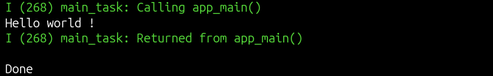

# ESP32 Hello World

A simple **ESP32 Hello World program** created to begin with basic ESP32 programming

## Hardware Requirements

* ESP32 MCU / Development Board
* USB cable

## Software Requirements

* ESP-IDF installed and configured
* VS Code

## Create Project

Open a terminal and run:

```bash
mkdir ~/ESP32_projects                         # Create a directory for ESP32 projects
cd ~/ESP32_projects                            # Navigate to the directory
source ~/esp-idf/export.sh                     # Load the ESP-IDF environment
idf.py create-project Hello_World              # Create a new ESP-IDF project
cd Hello_World                                 # Enter the project directory
code .                                         # Open the project in VS Code
```

## How to Run

Connect the ESP32 to the laptop using a USB cable.

Open a terminal and run:

```bash
source ~/esp-idf/export.sh                     # Load the ESP-IDF environment
idf.py --version                               # Check the installed ESP-IDF version
cd ~/ESP32_projects/Hello_World                # Navigate to the project directory
idf.py build                                   # Build the project
idf.py flash monitor                           # Flash the program and open the serial monitor
```

To stop the serial monitor:

```text
Ctrl + ]
```

### If the ESP32 Port Is Not Configured

If `idf.py flash monitor` gives a **port or permission error**, check the USB serial port assigned to the ESP32:

```bash
ls /dev/ttyUSB* /dev/ttyACM*                   # Find the ESP32 USB serial port
```

For example:

```text
/dev/ttyUSB0
```

If you get a **permission denied** error:

```bash
sudo usermod -aG dialout $USER                 # Give your user access to USB serial devices
```

Then specify the ESP32 port while flashing:

```bash
idf.py -p /dev/ttyUSB0 flash monitor           # Flash and monitor using the specified port
```

Replace `/dev/ttyUSB0` with the port assigned to your ESP32.

## Source Code

The main application code is located in:

```text
main/hello_world.c
```

## Expected Output

After flashing the program and opening the serial monitor, the ESP32 prints:

```text
Hello World!
```



